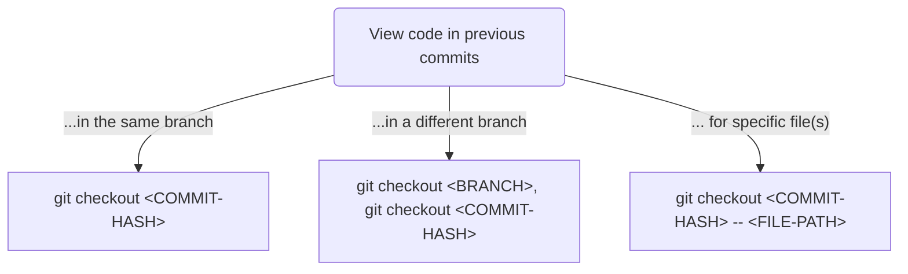
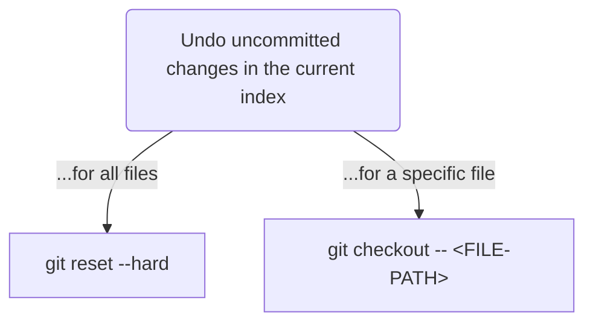
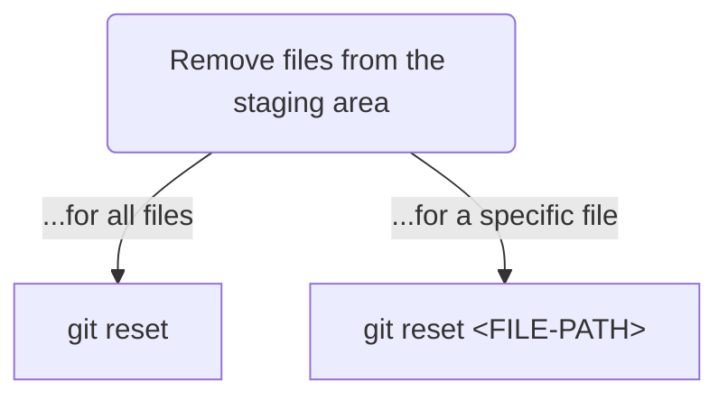
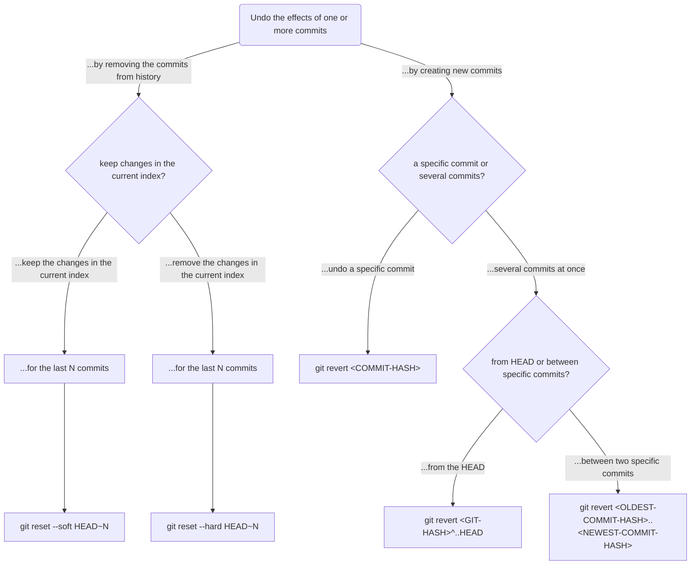

Have something in your code that you want to reverse but can't remember the Git command? The below flowcharts cover the commands to use for common git situations. Diagrams generated using [mermaid](https://mermaid-js.github.io/mermaid/).

